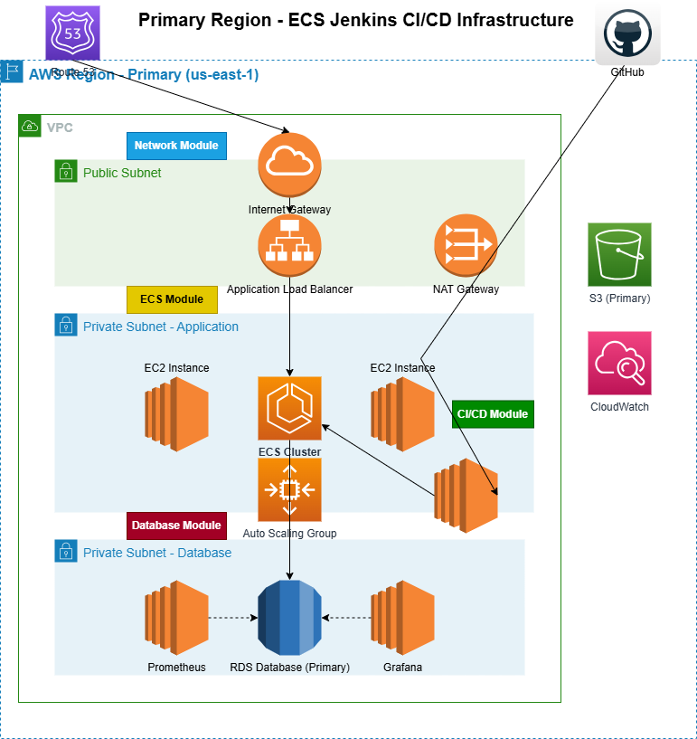
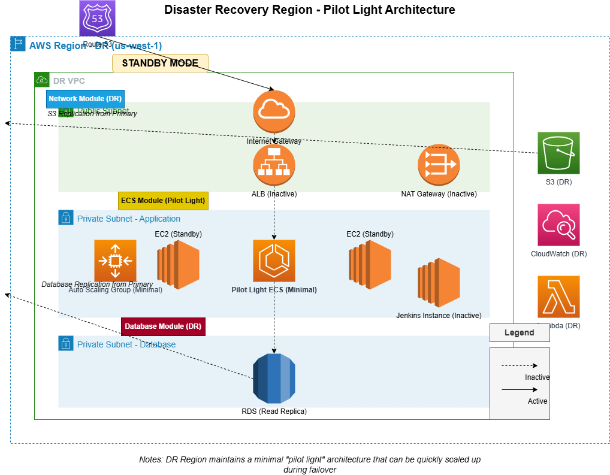

# AWS ECS Infrastructure with Jenkins CI/CD, RDS, ElastiCache, and Monitoring

## Overview

This Terraform project deploys a complete AWS infrastructure including:
- VPC with public/private subnets, dedicated database subnets, and ElastiCache subnets
- ECS Cluster using EC2 instances with blue/green deployment capability
- CI/CD pipeline with Jenkins and GitHub integration on self-healing EC2 instances
- RDS database in dedicated private subnets for enhanced security
- ElastiCache Redis cluster in dedicated subnets across multiple AZs
- Prometheus and Grafana monitoring solution
- Automated patching and AMI management

## Infrastructure Overview

- **Primary Region**: Main infrastructure with ECS cluster running on EC2 instances
- **DR Region**: Automated disaster recovery environment with a pilot light architecture
- **CI/CD**: Jenkins for continuous integration and delivery
- **Source Control**: Centralized Git repository

## Project Architecture

The infrastructure is designed with a modular approach allowing for independent deployment of components. This enables:
- Infrastructure changes without impacting applications
- Separate CI/CD processes for infrastructure and applications
- Environment-specific configurations (prod, dev, DR)
- Well-organized outputs in dedicated output files for each module
- Separate infrastructure environments with proper CIDR block segmentation
- Enhanced security with environment isolation

## Module Structure

The infrastructure is organized into the following modules:

### 1. Network Module
- **Purpose**: Establishes the network foundation
- **Components**:
    - VPC with public and private subnets
    - Internet Gateway and NAT Gateway
    - Route tables and security groups
    - VPC Flow logs and S3 bucket for access logs

### 2. IAM Module
- **Purpose**: Handles security and permissions
- **Components**:
    - ECS task execution and task roles
    - Jenkins IAM role for ECS deployments
    - Monitoring service roles

### 3. ECS Module
- **Purpose**: Runs containerized applications
- **Components**:
    - Cluster configuration (EC2 instances)
    - Task definitions and services with blue/green deployment capability
    - Load balancer and auto scaling
    - CodeDeploy integration for zero-downtime deployments

### 4. Database Module
- **Purpose**: Provides persistent storage
- **Components**:
    - RDS instance in dedicated private subnets
    - Encrypted storage with backups
    - High availability configuration across multiple Availability Zones

### 5. CI/CD Module
- **Purpose**: Enables continuous integration/deployment
- **Components**:
    - Jenkins server in Auto Scaling Group with latest ECS-optimized AMIs
    - GitHub integration setup
    - Deployment pipeline to ECS
    - Self-healing infrastructure with health checks

### 6. Monitoring Module
- **Purpose**: Observability and metrics
- **Components**:
    - Prometheus for metrics collection
    - Grafana for visualization
    - Alerting configuration

### 7. Security Module
- **Purpose**: Implements OWASP and AWS security best practices
- **Components**:
    - WAF configuration with OWASP rules
    - Security headers and TLS configuration
    - GuardDuty and AWS Config integration

### 8. Cache Module
- **Purpose**: Provides high-performance caching
- **Components**:
    - ElastiCache Redis cluster in dedicated private subnets
    - Multi-AZ deployment across three Availability Zones
    - Automated failover capabilities
    - Encrypted connections and data-at-rest

## Layered Infrastructure Approach

This project implements a layered approach to infrastructure management:

1. **Infrastructure Layer** (infrequent changes)
   - Core network resources, IAM, and security components

2. **Cluster Layer** (occasional changes)
   - ECS cluster, load balancers, and monitoring infrastructure

3. **Application Layer** (frequent changes)
   - Container definitions, services, and application-specific configurations

This layered approach provides:
- Reduced risk when deploying changes
- Faster application deployments
- Better access control between teams
- Improved CI/CD workflow

## Environment Configuration

The project supports multiple environments with specialized configurations:

### Development Environment
- Optimized for cost efficiency with spot instances
- Scaled-down resources for development and testing
- Full feature parity with production for accurate testing
- Dedicated VPC with its own DNS configuration

### Production Environment
- Highly available configuration using on-demand instances
- Enhanced scaling parameters for production workloads
- Stricter security controls and monitoring
- Isolated VPC with enterprise-grade security controls

### DR Pilot Light Environment
- Minimal running infrastructure in EU-West-1 region for faster recovery
- Uses spot instances for cost efficiency during normal operations
- Auto scaling capabilities to rapidly expand during failover events
- Consistent subnet and security configuration with production environment

## Disaster Recovery Strategy

This project implements a fully automated DR strategy with the following features:

- **Pilot Light Architecture**: Maintains minimal infrastructure in a secondary region to reduce costs
- **Route 53 Automated Failover**: Automatically detects primary region failure and redirects traffic to DR
- **Auto-Scaling DR Environment**: DR environment automatically scales from pilot light to full capacity during failover
- **Instance Type Transition**: Automatically switches from cost-effective spot instances to reliable on-demand instances during failover
- **Continuous Database Replication**: Ensures data consistency between primary and DR regions
- **Scheduled Monthly Testing**: Automated DR testing every Sunday after midnight during off-peak hours

For detailed information about the DR architecture and failover process, see [DR-README.md](docs/DR-README.md).

## Secrets Management

This project uses AWS Secrets Manager for handling sensitive information, including database and ElastiCache credentials:

1. No sensitive data is stored in the Terraform code
2. All secrets are referenced from AWS Secrets Manager
3. Environment-specific secrets are separated by path

## GitHub Workflow

The project uses GitHub for source control with the following branch strategy:
- `main`: Production-ready code
- `dev`: Development environment code
- `feature/*`: Feature branches
- `hotfix/*`: Emergency fixes

CI/CD pipelines are configured for automatic testing and deployment.

## Additional Documentation

For more detailed documentation, see:
- [Modular Deployment Guide](docs/MODULAR_DEPLOYMENT.md)
- [Layered Infrastructure Guide](docs/LAYERED_INFRASTRUCTURE.md)
- [Migration Guide](docs/MIGRATION_GUIDE.md)
- [Resilience Testing Playbook](docs/RESILIENCE_TESTING_PLAYBOOK.md)
- [Usage Instructions](USAGE.md)

## Architecture Diagrams

### Primary Infrastructure (eu-west-2)

### DR Pilot Light Infrastructure (eu-west-1)

## Recent Updates

- Added dedicated ElastiCache subnets across all environments
- Enhanced redundancy with three-AZ deployments for critical services
- Relocated DR environment to eu-west-1 for improved recovery times
- Implemented consistent CIDR block strategy across all environments

